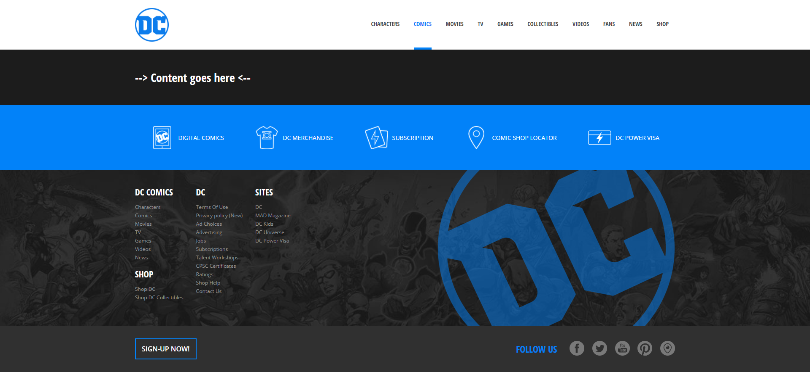

# Progetto DC Comics con React

Questo progetto, sviluppato in React, è dedicato alla presentazione dei contenuti dell’universo DC Comics. L'obiettivo è rappresentare in modo dinamico i diversi componenti che costituiscono la struttura dell’applicazione. In allegato è disponibile il layout di riferimento da replicare.




## Funzionalità

- **Componenti Dinamici**: Costruito con componenti React riutilizzabili.
- **Design Responsivo**: Ottimizzato per diverse dimensioni di schermo.
- **Integrazione API**: Recupera dati dinamicamente (se applicabile).
- **Routing**: Include navigazione per un'esperienza utente fluida.

## Installazione

1. Clona il repository:
    ```bash
    git clone https://github.com/your-username/react-dc-comic.git
    ```
2. Vai nella directory del progetto:
    ```bash
    cd react-dc-comic
    ```
3. Installa le dipendenze:
    ```bash
    npm install
    ```
4. Avvia il server di sviluppo:
    ```bash
    npm start
    ```

## Tecnologie Utilizzate

- **React**: Libreria frontend per la creazione di interfacce utente.
- **React Router**: Per la navigazione e il routing.
- **CSS**: Per lo stile dell'applicazione.
- **Opzionale**: Aggiungi eventuali librerie o strumenti aggiuntivi utilizzati.

## Struttura del Progetto

```
react-dc-comic/
├── public/
├── src/
│   ├── components/   → i mattoni dell'interfaccia
│   ├── pages/        → le varie sezioni dell'app
│   ├── assets/       → immagini e risorse visive
│   ├── App.js        → la regia dell’intera esperienza
│   ├── index.js      → il punto di ingresso nel DOM
├── package.json

```

## Contributi

I contributi sono benvenuti! Sentiti libero di aprire issue o inviare pull request.

- Ispirato a DC Comics.
- Creato con React.