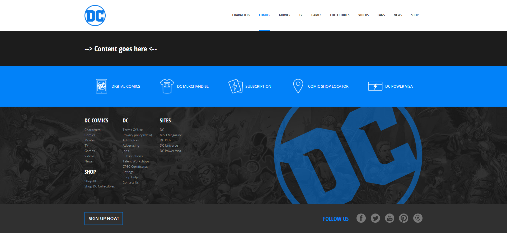

# DC Comics - React App

Progetto realizzato con React e Vite. L’obiettivo è visualizzare una collezione di fumetti DC Comics strutturando il layout in componenti riutilizzabili.

Layout da replicare:

## Tecnologie usate

- React
- Vite
- JavaScript (ES6+)
- CSS 
- Git

